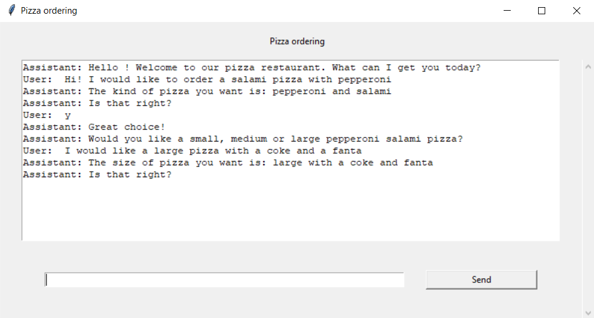

# Nokia_verseny_2023
 Ónodi-Kiss Viktor megoldásai a 2023-as Nokia versenyre

 # Bevezetés

 A programok megírásához és teszteléséhez a Pycharm Professional 2022.2.4-es verzióját használtam, amihez a JetBrains nagylelkű ingyenes tanulói licenszének köszönhetően jutottam hozzá. Továbbá fontos megemlítenem, hogy a programokat egy Windows 10-es AMD x64-es operációs rendszer architecktúrán írtam meg, a Python 3.11.0-ás verziójával írtam meg, melyet azért választottam, mert bár már tartalmazza a fontosabb funkciókat(gyorsabb futásidő) a 3.11-es verziónak köszönhetően, de már nem annyira friss, hogy ritka legyen.

 A programok tesztelése kizárólag a Pycharm beépített konzolán keresztül történt meg, de elméletben a parancssorban is lefutnak, a Dobble futtatásánál lehetőséget is adtam a felhasználónak, hogy a "dobble.py" beírása után egy integer bevitelével adja meg a kártyapakli méretét.

 # Snake

 ## Felhasználói dokumentáció

 A program elindításakor a felhasználó előtt megjelenik a feladatleírásban megadott 60 (+ 2 a határral) egység magas és 30 (+ 2 a határral) egység széles pálya.
 Illetve a felhasználót megkérdezi a program, hogy merre szeretne tovább lépni.

 

 Ezt követően a felhasználó a "balra", "jobbra", "fel" és "le" parancsokkal tud haladni, melyeket kedv szerint ki is egészítheti egy számmal, mely esetben a program annyiszor hajtja végre a lépést.

 

 Illetve a "meguntam" parancs beírásával a felhasználó ki is tud lépni a játékból.

 

 Fontos megemlíteni, hogy a bemenetnél nem számít a kis- és nagybetű. A program mind a kettő formájában végrehajtja az utasítást.

 A navigációval a felhasználó el tudja érni a "$" szimbólummal jelölt cseresznyéket, melyek érintésével a kígyó mérete megnő egyel.

 

Ezt követően a játék egészen addig megy, amíg a felhasználó vagy nekimegy a pálya szélét jelző "\*"-nak, vagy a "meguntam" szó beírásával befejezi a játékot. (Értelemszerűen a program leállítható az ablak bezárásával, vagy a "stop" gombra kattinttással)

## Fejlesztői dokumentáció

A program megírásánál figyelembe vettem a feladatleírásban megadott követelményeket.

A programot kettő részre bontottam a tervezés fázisánál. 

Az első rész, a "snake_main.py" felel a felhasználótól való adat kezelésre, illetve a szükséges függvények meghívásáért.

A második rész, a "map.py" felel a pályán végrehajtott műveletekért. Itt található a kígyó részeit tartalmazó "snakes" lista, a mozgatáshoz szükéges "MoveSnake" függvény és minden más is.

# Dobble

## Felhasználói dokumentáció

A program paraméterét a felhasználó megadhatja a konzolon keresztül, parancssori paraméterként.

Illetve megadhatja a konzolban megjelenő kérdére válaszolva is.

Fontos megjegyezni, hogy a kettő verzió nem működik egy időben. Egyszerre csak az egyik módon kap a program paramétert.

Ezt követően a program legenerálja a paraméterül megadott számnyi kártyából álló Dobble kártyapaklit.

## Fejlesztői dokumentáció

A programot kettő részre bontottam a tervezéskor.
A "dobble.py" tartalmazza a felhasználó adatbekérést, a "dobble_generator.py" pedig az alapján legenerálja a kártya paklit, melyet visszaad a "dobble.py"-nak, hogy kinyomtassa.

# Pizzarendelés

## Felhasználói dokumentáció

A program elindításakor a felhasználó elé kerül rögtön a kommunikációs felület, ahol a "chatbot" már rögtön fel is dobja az első üzenetet, amire várja a felhasználó válaszát. 

Itt a felhasználónak lehetősége van bezárni az ablakot a jobb felső sarokban található "X" gombra kattintva, illetve üzenetet írni az oldal alján, balra található szövegdobozba írva, majd azt elküldeni az "Enter" billentyű vagy a "send" gomb megnyomásával.

Ha a felhasználó egy lehetséges pizza típust (/típusokat) írt be, akkor azok helyességéről visszakérdez az aszisztens. 

Erre a "y"-el vagy "yes"-el válaszolva a felhasználó jóvá tudja hagyni a típust.

Ezt követően az asszisztens érdeklődik a pizza méret iránt. Itt tudja a felhasználó megadni az extrákat is, mint a pepsi, coke, water és fanta. Utána megintcsak visszajelzést kér az asszisztens a rendelés helyességéről, melyre "y"-el, vagy "yes"-el válaszolva a felhasználó le tudja adni a rendelését. 

A rendelés leadását követően a rendszer összesíti a rendelést egy "order.txt" nevű állományban, ami már tartalmazza az árat is. Innentől a rendelést a felhasználó az "order" kulcsszó beírásával tudja újraindítani.

A Pizzák és az egyéb termékek árai egy "prices.txt" nevű fájlban vannak elmentve.

## Fejlesztői dokumentáció

A program 4 különböző fájlra van szét bontva és 2 darab txt fájllal kommunikál.

A "pizzarendelo_file.py" szolgál a fájlokkal való kommunikációra, továbbá itt történik a rendelés adatainak az átalakítása.

A "pizzarendelo_assistant.py" tartalmazza az aszisztenshez tartozó kódot, amihez az adatot a GUI-ból olvassa ki.

A "pizzarendelo_GUI.py"-ben találhatóak a Grafikus Felhasználó Felület, azaz GUI, felépítséhez szükséges függvények, illetve itt fut a kettő szál is.

A "pizzarendelo_main.py" csak a program elindítására szolgál.

## Felhasznált könyvárak

### Tkinter

A programhoz tartozó GUI megírásához használatba vettem a Tkinter könyvtárat. Azért választottam ezt, mert ezzel már korábban volt egy kevés tapasztalatom, illetve ehhez sikerült a legtöbb támogatást találnom.

### Threading

Az aszisztens GUI-val való párhuzamos futtatásához a python Threading könyvtárát használtam. Ezt a könyvtárat ugyancsak azért választottam mert már korábban volt benne tapasztalatom, illetve sok segítséget találtam hozzá az internetes fórumokon. 
Csak is egyetlenegy függvény fut a Threading-en keresztül indított szálon, az pedig a "pizzarendelo_GUI.py" "Run" függvénye, ami az asztisztenst futtatja.

---

Ezen kívül felhasználtam a time könyvtárat, ezzel adva egy kevés időt az asszistens válaszaihoz, hogy természetesebbnek érződjön a válasza.